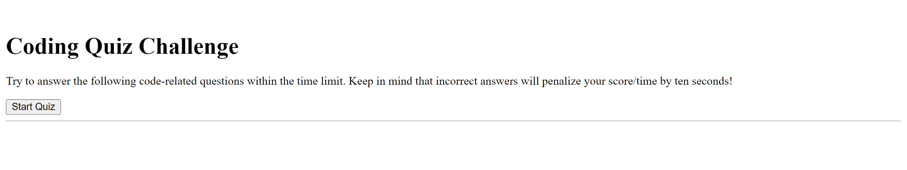
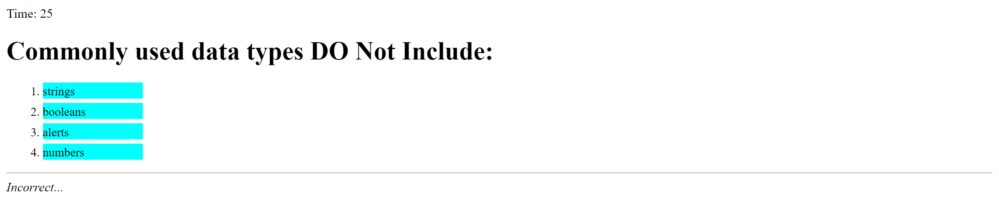
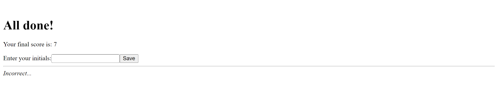
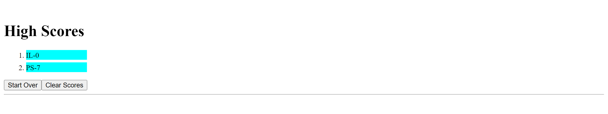

# Coding Quiz

## Description

This project is a short coding quiz with 5 questions. setInterval is used to display a Timer. At the end of the quiz you can enter initials and they will be saved along with the score in localStorage. A list of high scores is then displayed where you have the option to start again or clear the scores.

## Installation

N/A

## Usage

Once Start Quiz button is pressed a timer will begin to count down. When the first question is answered, another question appears. There is a display at the bottom that shows if answer was correct/incorrect. If answered incorrectly, 10 seconds will be subtracted from the time left. The final score is the time left on the clock. Once the quiz is over, because all questions where answered or ran out of time; enter the initials. A high scores page will be shown next, along with the options to start quiz again or clear the scores. Start the quiz again to see a longer list of high scores.

https://arisof.github.io/coding-quiz/

 Screenshots attached:

## Credits

Sofia Villalpando

## License

MIT License
